<div align="center">

# 🎭 Mixamo MCP

### AI로 Mixamo 애니메이션을 자동 다운로드

[](https://modelcontextprotocol.io)
[](https://github.com/HaD0Yun/unity-mcp-mixamo/releases)
[](LICENSE)
[](https://github.com/HaD0Yun/unity-mcp-mixamo/releases)

**Claude Desktop • Cursor • VS Code • Windsurf** 등 모든 MCP 클라이언트 지원

한국어 | [English](README_EN.md)

<br>

[<kbd> <br> 📥 다운로드 <br> </kbd>](https://github.com/HaD0Yun/unity-mcp-mixamo/releases/latest)

</div>

---

## ✨ 특징

| | 기능 | 설명 |
|:---:|:---|:---|
| 🚀 | **원클릭 설치** | exe 파일 하나로 끝, Python 불필요 |
| 🤖 | **AI 통합** | 자연어로 애니메이션 요청 |
| 📦 | **배치 다운로드** | 여러 애니메이션 한번에 다운로드 |
| 🎮 | **Unity 지원** | FBX + Humanoid 자동 설정 |
| 🔌 | **범용 MCP** | 모든 MCP 클라이언트 호환 |

---

## 📥 설치 (2분)

### Step 1: 다운로드

<div align="center">

[<kbd> <br> 📥 **mixamo-mcp.exe** 다운로드 <br> </kbd>](https://github.com/HaD0Yun/unity-mcp-mixamo/releases/latest)

</div>

원하는 폴더에 저장 (예: `C:\Tools\mixamo-mcp.exe`)

### Step 2: MCP 클라이언트 설정

사용하는 AI 도구에 맞게 설정하세요:

<details>
<summary><b>🟣 Claude Desktop</b></summary>

설정 파일 열기:
- **Windows**: `%APPDATA%\Claude\claude_desktop_config.json`
- **Mac**: `~/Library/Application Support/Claude/claude_desktop_config.json`

```json
{
  "mcpServers": {
    "mixamo": {
      "command": "C:\\Tools\\mixamo-mcp.exe"
    }
  }
}
```
</details>

<details>
<summary><b>🟢 Cursor</b></summary>

Settings → MCP → Add Server

```json
{
  "mcpServers": {
    "mixamo": {
      "command": "C:\\Tools\\mixamo-mcp.exe"
    }
  }
}
```
</details>

<details>
<summary><b>🔵 VS Code (Copilot MCP)</b></summary>

`.vscode/mcp.json` 파일 생성:

```json
{
  "servers": {
    "mixamo": {
      "command": "C:\\Tools\\mixamo-mcp.exe"
    }
  }
}
```
</details>

<details>
<summary><b>🟡 Windsurf</b></summary>

`~/.codeium/windsurf/mcp_config.json` 파일 편집:

```json
{
  "mcpServers": {
    "mixamo": {
      "command": "C:\\Tools\\mixamo-mcp.exe"
    }
  }
}
```
</details>

<details>
<summary><b>⚪ 기타 MCP 클라이언트</b></summary>

대부분의 MCP 클라이언트는 비슷한 형식을 사용합니다:

```json
{
  "mcpServers": {
    "mixamo": {
      "command": "C:\\Tools\\mixamo-mcp.exe"
    }
  }
}
```
</details>

> ⚠️ **주의**: 경로의 `\`를 `\\`로 입력해야 합니다!

### Step 3: AI 도구 재시작

완전히 종료 후 다시 실행.

### Step 4: Mixamo 토큰 설정

1. [mixamo.com](https://www.mixamo.com) 로그인
2. `F12` → Console 탭
3. 아래 명령어 입력 (토큰이 클립보드에 복사됨):
   ```javascript
   copy(localStorage.access_token)
   ```
4. AI에게 말하기:
   ```
   mixamo-auth accessToken="여기에_붙여넣기"
   ```

### ✅ 완료!

---

## 🎬 사용법

### 애니메이션 검색
```
mixamo-search keyword="run"
```

### 단일 다운로드
```
mixamo-download animationIdOrName="idle" outputDir="D:/MyGame/Assets/Animations"
```

### 📦 여러 개 한번에 다운로드 (추천)
```
mixamo-batch animations="idle,walk,run,jump" outputDir="D:/MyGame/Assets/Animations" characterName="Player"
```

### 키워드 목록 보기
```
mixamo-keywords
```

---

## 🏷️ 애니메이션 키워드

| 카테고리 | 키워드 |
|:--------:|--------|
| 🚶 **이동** | `idle` `walk` `run` `jump` `crouch` `climb` `swim` |
| ⚔️ **전투** | `attack` `punch` `kick` `sword` `block` `dodge` `death` |
| 😀 **감정** | `wave` `bow` `clap` `cheer` `laugh` `sit` `talk` |
| 💃 **댄스** | `dance` `hip hop` `salsa` `robot` `breakdance` |

> 💡 `mixamo-keywords`로 전체 목록 확인

---

## 🎮 Unity 사용자 가이드

### 기본 워크플로우

```mermaid
graph TD
    A[AI로 다운로드 요청] --> B[FBX 파일 저장]
    B --> C[Unity 자동 임포트]
    C --> D[Rig → Humanoid 설정]
    D --> E[Animator Controller 생성]
    E --> F[캐릭터에 적용]
    
    style A fill:#22c55e,color:#fff
    style F fill:#3b82f6,color:#fff
```



### 자동화 원하면?

**Unity Helper** 패키지 설치:

```
https://github.com/HaD0Yun/unity-mcp-mixamo.git?path=unity-helper
```

✅ FBX 임포트 시 자동 Humanoid 리그 설정  
✅ 폴더 선택 → Tools → Mixamo Helper → Animator 자동 생성

---

## ❓ 문제 해결

| 문제 | 해결 |
|:-----|:-----|
| 🔴 AI에서 도구가 안 보임 | AI 도구 완전 종료 후 재시작 |
| 🔴 "Token expired" 에러 | mixamo.com에서 새 토큰 복사 |
| 🔴 다운로드 실패 | 인터넷 연결 확인, 토큰 재설정 |
| 🔴 exe 실행 안됨 | Windows Defender에서 허용 |

---

## 🛠️ 고급 설정

<details>
<summary><b>개발자용 (소스에서 설치)</b></summary>

```bash
git clone https://github.com/HaD0Yun/unity-mcp-mixamo.git
cd unity-mcp-mixamo/server
pip install -e .
```

MCP 클라이언트 설정:
```json
{
  "mcpServers": {
    "mixamo": {
      "command": "mixamo-mcp"
    }
  }
}
```
</details>

<details>
<summary><b>exe 직접 빌드</b></summary>

```bash
cd server
pip install pyinstaller
python build.py
# 결과: dist/mixamo-mcp.exe
```
</details>

---

## 📁 프로젝트 구조

```
unity-mcp-mixamo/
├── 📂 server/           # Python MCP 서버
│   ├── 📂 dist/         # 빌드된 exe
│   └── 📂 src/          # 소스 코드
└── 📂 unity-helper/     # Unity 유틸리티 (선택)
```

---

## 📜 라이센스

MIT License - 자유롭게 사용하세요!

---

## 🙏 크레딧

- [Mixamo](https://www.mixamo.com) by Adobe
- [MCP](https://modelcontextprotocol.io) by Anthropic

---

<div align="center">

**⭐ 유용했다면 Star 부탁드립니다! ⭐**

[Issues](https://github.com/HaD0Yun/unity-mcp-mixamo/issues) · [Releases](https://github.com/HaD0Yun/unity-mcp-mixamo/releases)

</div>
