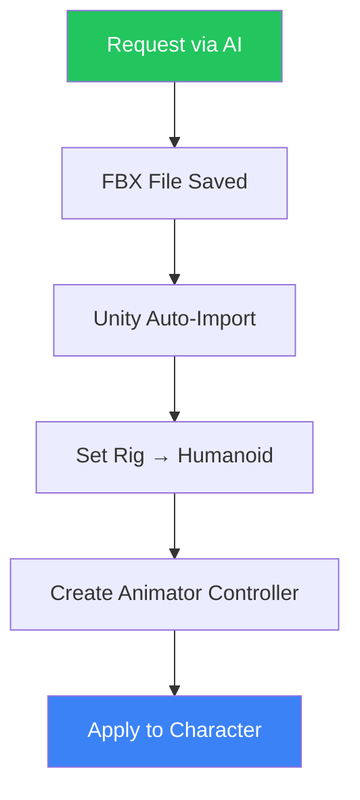

<div align="center">

# 🎭 Mixamo MCP

### Auto-download Mixamo Animations with AI

[](https://modelcontextprotocol.io)
[](https://github.com/HaD0Yun/unity-mcp-mixamo/releases)
[](LICENSE)
[](https://github.com/HaD0Yun/unity-mcp-mixamo/releases)

Works with **Claude Desktop • Cursor • VS Code • Windsurf** and all MCP clients

[한국어](README.md) | English

<br>

[<kbd> <br> 📥 Download <br> </kbd>](https://github.com/HaD0Yun/unity-mcp-mixamo/releases/latest)

</div>

---

## ✨ Features

| | Feature | Description |
|:---:|:---|:---|
| 🚀 | **One-Click Install** | Single exe file, no Python needed |
| 🤖 | **AI Integration** | Request animations in natural language |
| 📦 | **Batch Download** | Download multiple animations at once |
| 🎮 | **Unity Support** | FBX + Humanoid auto-setup |
| 🔌 | **Universal MCP** | Compatible with all MCP clients |

---

## 📥 Installation (2 min)

### Step 1: Download

<div align="center">

[<kbd> <br> 📥 **Download mixamo-mcp.exe** <br> </kbd>](https://github.com/HaD0Yun/unity-mcp-mixamo/releases/latest)

</div>

Save to any folder (e.g., `C:\Tools\mixamo-mcp.exe`)

### Step 2: Configure Your MCP Client

Choose your AI tool:

<details>
<summary><b>🟣 Claude Desktop</b></summary>

Open config file:
- **Windows**: `%APPDATA%\Claude\claude_desktop_config.json`
- **Mac**: `~/Library/Application Support/Claude/claude_desktop_config.json`

```json
{
  "mcpServers": {
    "mixamo": {
      "command": "C:\\Tools\\mixamo-mcp.exe"
    }
  }
}
```
</details>

<details>
<summary><b>🟢 Cursor</b></summary>

Settings → MCP → Add Server

```json
{
  "mcpServers": {
    "mixamo": {
      "command": "C:\\Tools\\mixamo-mcp.exe"
    }
  }
}
```
</details>

<details>
<summary><b>🔵 VS Code (Copilot MCP)</b></summary>

Create `.vscode/mcp.json`:

```json
{
  "servers": {
    "mixamo": {
      "command": "C:\\Tools\\mixamo-mcp.exe"
    }
  }
}
```
</details>

<details>
<summary><b>🟡 Windsurf</b></summary>

Edit `~/.codeium/windsurf/mcp_config.json`:

```json
{
  "mcpServers": {
    "mixamo": {
      "command": "C:\\Tools\\mixamo-mcp.exe"
    }
  }
}
```
</details>

<details>
<summary><b>⚪ Other MCP Clients</b></summary>

Most MCP clients use a similar format:

```json
{
  "mcpServers": {
    "mixamo": {
      "command": "C:\\Tools\\mixamo-mcp.exe"
    }
  }
}
```
</details>

> ⚠️ **Note**: Use `\\` for backslashes in paths!

### Step 3: Restart Your AI Tool

Fully quit and relaunch.

### Step 4: Set Mixamo Token

1. Log in to [mixamo.com](https://www.mixamo.com)
2. Press `F12` → Console tab
3. Run this command (copies token to clipboard):
   ```javascript
   copy(localStorage.access_token)
   ```
4. Tell your AI:
   ```
   mixamo-auth accessToken="paste_here"
   ```

### ✅ Done!

---

## 🎬 Usage

### Search Animations
```
mixamo-search keyword="run"
```

### Download Single Animation
```
mixamo-download animationIdOrName="idle" outputDir="D:/MyGame/Assets/Animations"
```

### 📦 Batch Download (Recommended)
```
mixamo-batch animations="idle,walk,run,jump" outputDir="D:/MyGame/Assets/Animations" characterName="Player"
```

### List Keywords
```
mixamo-keywords
```

---

## 🏷️ Animation Keywords

| Category | Keywords |
|:--------:|----------|
| 🚶 **Movement** | `idle` `walk` `run` `jump` `crouch` `climb` `swim` |
| ⚔️ **Combat** | `attack` `punch` `kick` `sword` `block` `dodge` `death` |
| 😀 **Emotion** | `wave` `bow` `clap` `cheer` `laugh` `sit` `talk` |
| 💃 **Dance** | `dance` `hip hop` `salsa` `robot` `breakdance` |

> 💡 Use `mixamo-keywords` for the full list

---

## 🎮 Unity User Guide

### Basic Workflow



### Want Automation?

Install the **Unity Helper** package:

```
https://github.com/HaD0Yun/unity-mcp-mixamo.git?path=unity-helper
```

✅ Auto Humanoid rig on FBX import  
✅ Select folder → Tools → Mixamo Helper → Auto-generate Animator

---

## ❓ Troubleshooting

| Problem | Solution |
|:--------|:---------|
| 🔴 Tools not showing in AI | Fully restart your AI tool |
| 🔴 "Token expired" error | Get new token from mixamo.com |
| 🔴 Download failed | Check internet, reset token |
| 🔴 exe won't run | Allow in Windows Defender |

---

## 🛠️ Advanced Setup

<details>
<summary><b>For Developers (Install from Source)</b></summary>

```bash
git clone https://github.com/HaD0Yun/unity-mcp-mixamo.git
cd unity-mcp-mixamo/server
pip install -e .
```

MCP client config:
```json
{
  "mcpServers": {
    "mixamo": {
      "command": "mixamo-mcp"
    }
  }
}
```
</details>

<details>
<summary><b>Build exe Yourself</b></summary>

```bash
cd server
pip install pyinstaller
python build.py
# Output: dist/mixamo-mcp.exe
```
</details>

---

## 📁 Project Structure

```
unity-mcp-mixamo/
├── 📂 server/           # Python MCP server
│   ├── 📂 dist/         # Built exe
│   └── 📂 src/          # Source code
└── 📂 unity-helper/     # Unity utilities (optional)
```

---

## 📜 License

MIT License - Use freely!

---

## 🙏 Credits

- [Mixamo](https://www.mixamo.com) by Adobe
- [MCP](https://modelcontextprotocol.io) by Anthropic

---

<div align="center">

**⭐ If you found this useful, please Star! ⭐**

[Issues](https://github.com/HaD0Yun/unity-mcp-mixamo/issues) · [Releases](https://github.com/HaD0Yun/unity-mcp-mixamo/releases)

</div>
